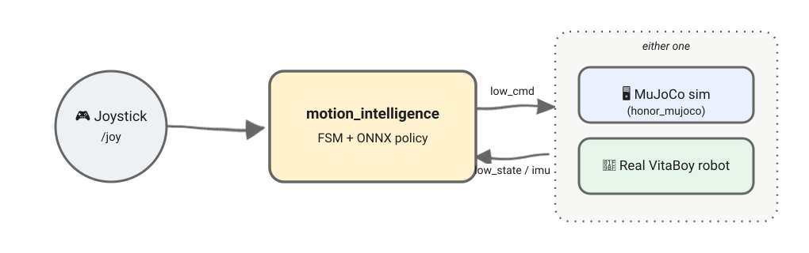

# Humanoid Control (C++)

<div align="center">

**面向 VitaBoy 人形机器人的 RL 策略部署仓库，一个控制器、一个 FSM、一套 ROS 2 话题，以同样的方式驱动 MuJoCo 仿真和真实机器人。**

[](https://en.cppreference.com/w/cpp/17)
[](https://docs.ros.org/en/humble/)
[](https://onnxruntime.ai/)
[](https://releases.ubuntu.com/22.04/)

[English](readme.md) | [简体中文](readme_zh.md)

</div>

## ✨ 简介

控制器运行一个有限状态机，通过 ROS 2 读取手柄指令和机器人状态，运行 ONNX 策略并下发关节指令。
同一套代码通过相同的 ROS 2 话题，既能驱动 [`honor_mujoco`](https://github.com/HonorRobotics/honor_mujoco) 仿真，也能驱动真实机器人。



## 🧩 FSM 状态


| 状态         | 说明                              |
| ------------ | --------------------------------- |
| `Passive`    | 关节零力矩（开机 / 最安全的状态） |
| `Damper`     | 关节阻尼（kp = 0，kd 取自配置）   |
| `Recovery`   | 从当前姿态余弦插值过渡到站立姿态  |
| `Locomotion` | 由 ONNX 策略驱动的速度跟踪行走    |
| `Tracking`   | 由 ONNX 策略驱动的全身动作跟踪    |

## 📦 安装

### 要求

- Linux（Ubuntu 22.04）
- [uv](https://docs.astral.sh/uv/getting-started/installation/)
- [ROS 2 Humble](https://docs.ros.org/en/humble/Installation/Ubuntu-Install-Debs.html)

### 克隆项目

克隆本仓库和 [`honor_robot_sdk`](https://github.com/HonorRobotics/honor_robot_sdk)（放在同一级目录下）：

```bash
git clone https://github.com/HonorRobotics/honor_rl_deploy.git

git clone https://github.com/HonorRobotics/honor_robot_sdk.git
```

### 安装依赖

```bash
cd honor_rl_deploy

./scripts/install.sh
```

### 检查环境

检查所有编译依赖

```bash
./scripts/check_env.sh
```

## 🚀 使用

### 仿真机器人

#### 第 1 步：安装SDK

请先下载 [`honor_mujoco`](https://github.com/HonorRobotics/honor_mujoco) 仓库，安装好相关依赖和SDK。

新开一个终端：

```bash
cd honor_mujoco

source ./scripts/build_sdk_msgs.sh --honor-sdk /your_path/to_sdk
```

#### 第 2 步：启动 MuJoCo

```bash
./scripts/run_mujoco.sh
```

#### 第 3 步：启动控制器

新开一个终端：

```bash
cd honor_rl_deploy

./scripts/run_motion_intelligence.sh \
    --fastdds false \
    --is-sim true \
    --joy-topic /joy \
    --joy-type keyboard
```

- ✅ 没有 F710 手柄：默认使用键盘控制，见[键盘按键](#键盘按键)
- ✅ 有 F710 手柄：改传 `--joy-type game_controller`，见[手柄按键](#手柄按键)

### 真实机器人

#### 第 1 步：开机

给 vita_boy 机器人上电，用网线连接机器人。

VitaBoy 机器人开机后，会默认启动预置的 `motion_intelligence` 控制器，此时关节为**零力矩**（Passive）。

注意：确保你的电脑没有连接除机器人外的任何网线。

#### 第 2 步：进入调试模式

遥控器按下 `S1 + S2` 进入调试模式。

关节会切换到**阻尼模式**（Damper），此时才能使用本仓库的代码控制机器人。

#### 第 3 步：运行控制器

##### 场景 1：使用外部主机调试新控制器

在本地电脑终端运行：

**第 1 步：安装SDK**

新开一个终端：

```bash
cd honor_rl_deploy

source ./scripts/build_sdk_msgs.sh --honor-sdk /your_path/to_sdk
```

**第 2 步：部署前检查**

把本机 IP 设为 `192.168.42.xxx`(比如`192.168.42.200`)，再运行检查：

```bash
./scripts/check_robot.sh \
    --joy-check false \
    --joy-topic /joy
```

脚本会检查网络、SSH 登录与 `motion_intelligence.service` 状态，以及 ROS 2 层。继续下面任一场景前，请先PASS所有检查项。

**第 3 步：启动控制器**

```bash
./scripts/run_motion_intelligence.sh \
    --fastdds true \
    --is-sim false \
    --joy-topic /joy \
    --joy-type keyboard
```

随后按照[键盘按键](#键盘按键)或者[手柄按键](#手柄按键)操作机器人。

- ✅ 没有 F710 手柄：默认使用键盘控制，见[键盘按键](#键盘按键)
- ✅ 有 F710 手柄：改传 `--joy-type game_controller`，见[手柄按键](#手柄按键)

##### 场景 2：在机载电脑上调试新控制器

**第 1 步：拷贝本地工程代码**

在本地电脑上，将克隆的代码打包成zip文件，再用如下命令拷贝到机载电脑。

注意：如果代码已经编译，请删除 honor_rl_deploy/source/build、honor_robot_sdk/common/build、honor_robot_sdk/common/build_dist 编译文件。

```bash
scp /path/to/your/honor_rl_deploy.zip hihonor@192.168.42.201:/data/your_path/

scp /path/to/your/honor_robot_sdk.zip hihonor@192.168.42.201:/data/your_path/
```

**第 2 步：SSH 登陆机载电脑**

```bash
ssh hihonor@192.168.42.201

密码 hihonor
```

**第 3 步：解压拷贝的工程代码**

注意：第3、4、5、6 步都在机载电脑的 SSH 会话中执行。

```bash
unzip /path/to/your/honor_rl_deploy.zip

unzip /path/to/your/honor_robot_sdk.zip
```

**第 4 步：安装SDK**

```bash
cd /path/to/your/honor_rl_deploy

source ./scripts/build_sdk_msgs.sh --honor-sdk /your_path/to_sdk
```

**第 5 步：部署前检查**

```bash
./scripts/check_robot.sh \
    --joy-check true \
    --joy-topic /xlab/hr/joy_state_debug
```

check_robot.sh脚本会检查网络、SSH 登录与 `motion_intelligence.service` 状态，以及 ROS 2 层。继续下面任一场景前，请先PASS所有检查项。

**第 6 步：编译并运行控制器**

```bash
./scripts/run_motion_intelligence.sh \
    --fastdds true \
    --is-sim false \
    --joy-topic /xlab/hr/joy_state_debug \
    --joy-type robot_remote_control
```

随后按照[遥控器按键](#遥控器按键)操作机器人。

### 按键定义

#### 手柄按键

在 [`base.yaml`](source/config/vita_boy/V1/base.yaml) 中把 `joy_type` 设为 `"game_controller"`，或者给 `run_motion_intelligence.sh` 传 `--joy-type game_controller`


| 按键组合                             | 目标状态               |
| ------------------------------------ | ---------------------- |
| `LB` + `A`                           | Passive                |
| `LB` + `B`                           | Damper                 |
| `LB` + `X`                           | Recovery               |
| `LB` + `Y`                           | Locomotion             |
| `RB` + `X`（仅在 Locomotion 状态下） | Tracking               |
| `LB` + `RB`                          | Damper（一键急停）     |

左摇杆（仅在 Locomotion 状态下）：↕ 前进 / 后退（`vx`），↔ 左移 / 右移（`vy`）。
右摇杆（仅在 Locomotion 状态下）：↔ 左转 / 右转（`vz`）。

#### 遥控器按键

在 [`base.yaml`](source/config/vita_boy/V1/base.yaml) 中把 `joy_type` 设为 `"robot_remote_control"`，或者给 `run_motion_intelligence.sh` 传 `--joy-type robot_remote_control`。


| 遥控器组合                            | 目标状态               |
| ------------------------------------- | ---------------------- |
| `S1` + `R1`                           | Passive                |
| `S1` + `R2`                           | Recovery               |
| `S1` + `M6`                           | Damper                 |
| `S1` + `R3`                           | Locomotion             |
| `M2` + `R2`（仅在 Locomotion 状态下） | Tracking               |
| `S1` + `M2`                           | Damper（一键急停）     |
| `S1` + `S2`                           | 进入调试模式           |

左摇杆（仅在 Locomotion 状态下）：↕ 前进 / 后退（`vx`），↔ 左移 / 右移（`vy`）。
右摇杆（仅在 Locomotion 状态下）：↔ 左转 / 右转（`vz`）。

#### 键盘按键

在 [`base.yaml`](source/config/vita_boy/V1/base.yaml) 中把 `joy_type` 设为 `"keyboard"`，或者给 `run_motion_intelligence.sh` 传 `--joy-type keyboard`。


| 按键                                | 目标状态               |
| ----------------------------------- | ---------------------- |
| `P`                                 | Passive                |
| `Space`                             | Damper                 |
| `R`                                 | Recovery               |
| `L`                                 | Locomotion             |
| `M`（仅在 Locomotion 状态下）       | Tracking               |

移动（仅在 Locomotion 状态下）：`W`/`S` 前进 / 后退（`vx`）；`A`/`D` 左移 / 右移（`vy`）；`Q`/`E` 左转 / 右转（`vz`）。

💡 **提示：**

1. 对于sim2sim仿真，上面表格按键需要鼠标键点击 run_motion_intelligence.sh 运行的终端才能使用，
   mujoco侧的按键需要点击mujoco界面才能使用。
   建议在控制状态进入locomotion后，点击mujoco界面并按9键盘放下机器人，
   鼠标再点击run_motion_intelligence.sh终端，使用上表按键操作机器人。
2. 建议的首次上电测试顺序——**Passive → Recovery → Locomotion → Tracking → Locomotion → Damper**。

## 🛠️ 二次开发

```text
<workspace>/
└── honor_rl_deploy/
    ├── source/
    │   ├── src/, include/                 # 控制器、状态机、状态估计、指令、硬件接口
    │   ├── config/vita_boy/V1/            # base.yaml、command.yaml 及各状态的策略配置
    │   └── thirdparty/                    # onnxruntime、cnpy、argparse
    └── scripts/
        ├── install.sh                     # 检查 uv + ROS，创建 .venv，安装依赖
        ├── build_sdk_msgs.sh              # 编译 honor_robot_sdk 消息包
        ├── check_env.sh                   # 检查完整的 C++ 编译环境
        ├── check_robot.sh                 # 部署前检查：网络 + SSH + ROS 2 话题
        ├── run_motion_intelligence.sh     # 编译工程 + 控制器
        └── fastdds_profile.xml.template   # Fast DDS 网卡白名单配置
```
